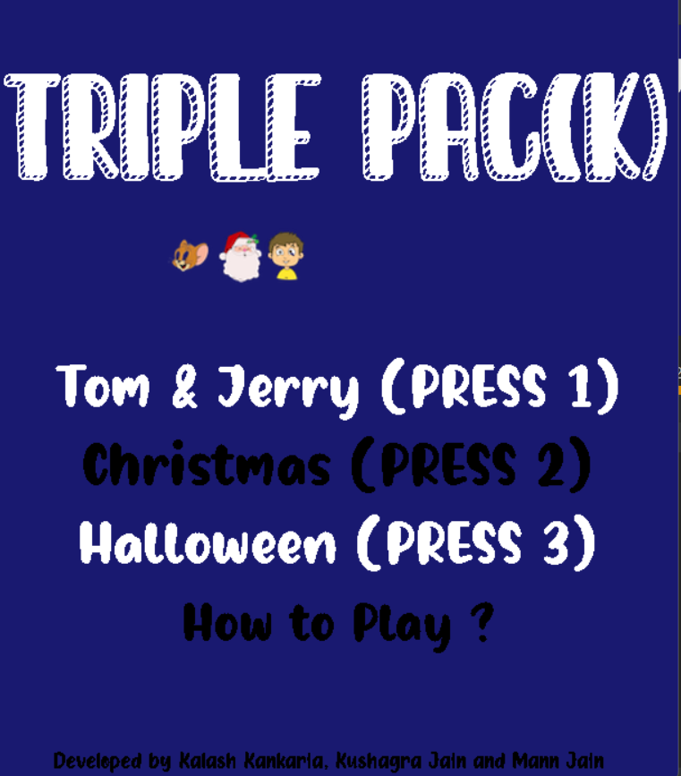
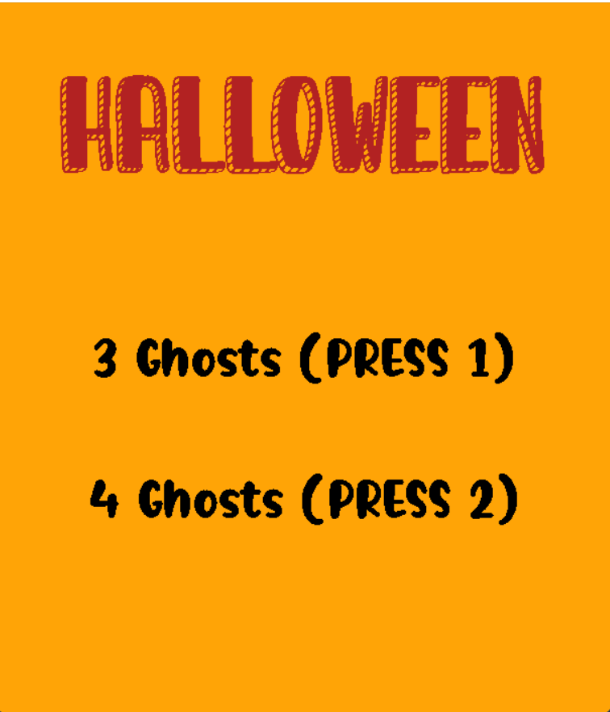
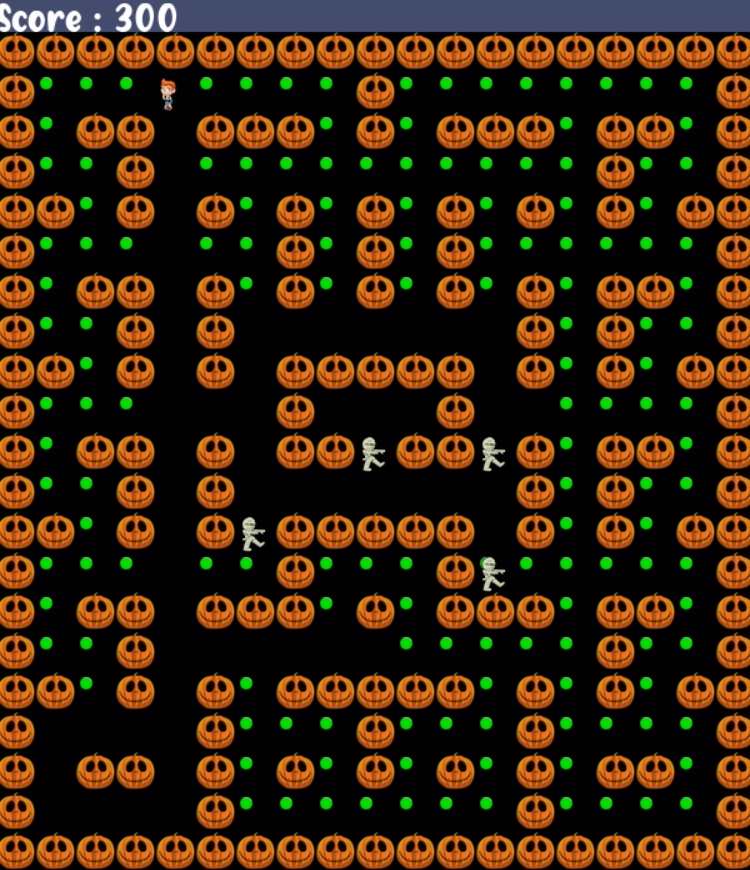
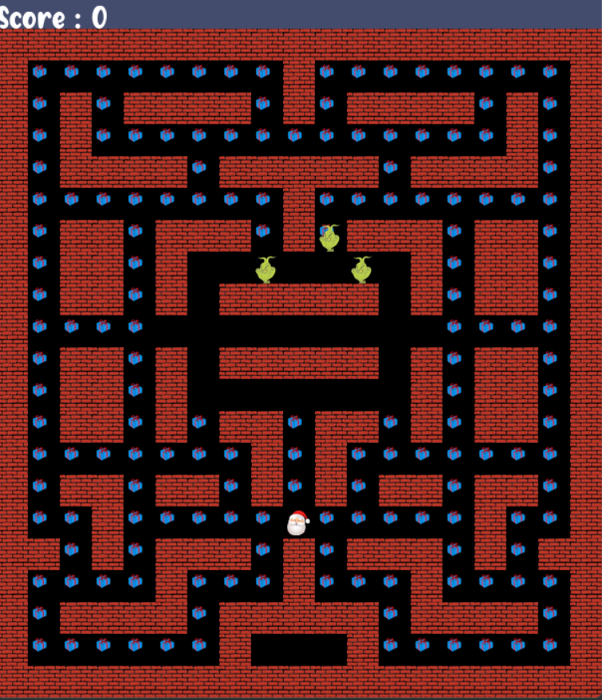
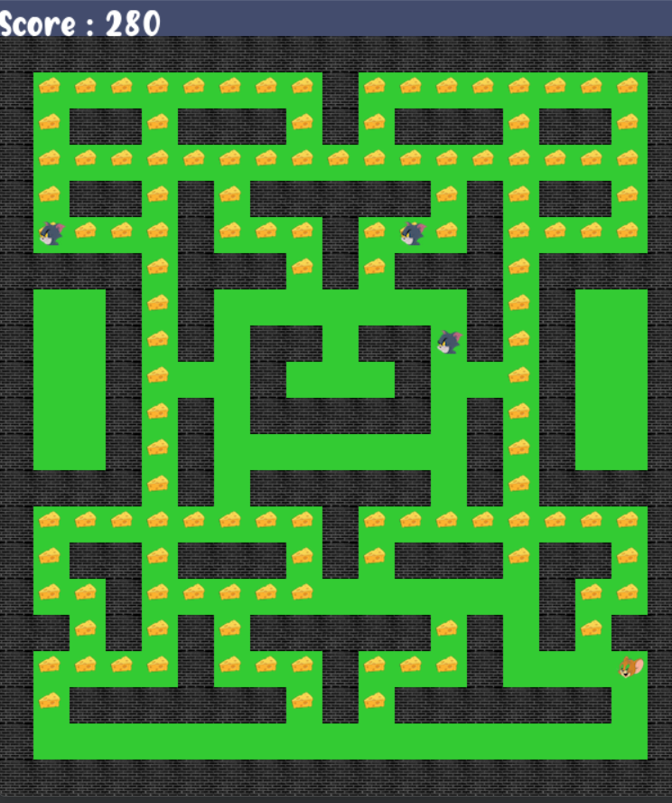

# Triple Pac(k) Game

### Introduction
This is a PC game inspired by the famous pacman game involving three themes:
* Tom and Jerry
* Christmas
* Halloween

The project presents the code on a graphical user interface.
  
### Modules and Packages
The "pygame" library has to be installed to run the code on your local. The code is fully built in python.

### Files and Folders
* `README.md`: The current file containing the info of the project.
* Fonts: This folder contains the fonts used in the project.
* Images: This folder contains the images used in different themes for the project.
* `main.py`: This is the main code file containing the game logic and this file has to be run to get started with the game. This file imports all other python files.
* `colors.py`: This file contains the RGB values of different colors used in the project. It is maintained in this separate file.
* `configuration.py`: This file contains the basic configuration stored in variables such as width and height of the game window, font sizes and different coordinates and dimensions of the game maze and assets.
* `images.py`: This file stores the images in variables to be loaded on the game window as per the theme.
* `levels.py`: This file contains the player and enemy coordinates along with the maze for different levels. This code contains the design of the code. IF the values in this code changes, our design changes. There is no need to change in the main code. This file can be given to a game designer to design different mazes and levels.

### How to Play?
The game has a very easy and smooth user interface. The game can be won by collecting all the coins/gifts without being attacked by the enemy. The score is displayed on the top left side of the screen window. All instructions to choose themes and levels are provided. The player movement can be controlled by the `arrow-up` , `arrow-down`, `arrow-left` and the `arrow-right` keys. 

### Screenshots and User Interface
Screen 1(MainScreen)

Screen 2(Theme Screen)

Screen 3(Game Screen)

